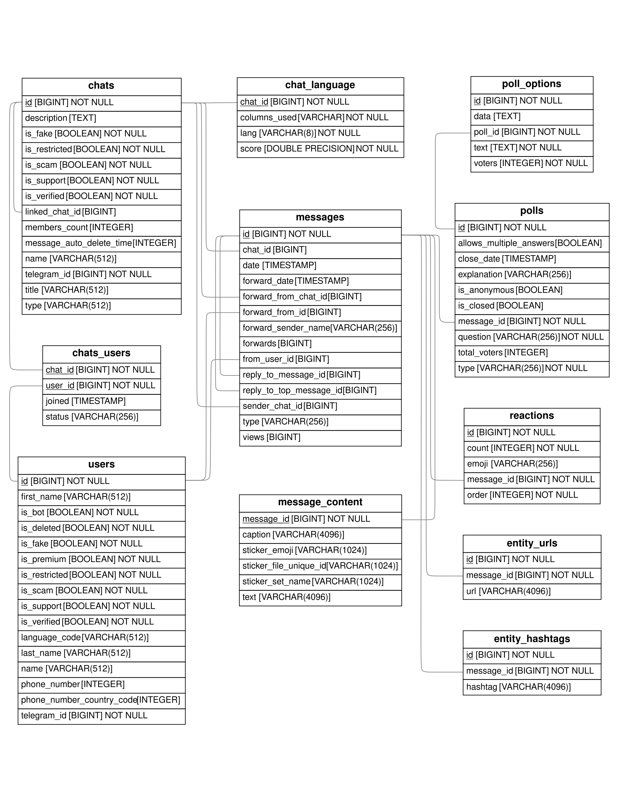

# Telegram dataset

This is a [datasheet](https://arxiv.org/abs/1803.09010) for the Telegram dataset. If you use this dataset, please acknowledge it by citing our work:

```
@misc{TeraGram,
  title = {TeraGram: A Structured Longitudinal Dataset of the Telegram Messenger},
  author = {Golovin, Anastasia and Mohr, Sebastian B. and Gottwald, Arne I. and Hvid, Ulrik and Trivedi, Srushhti and Neto, Joao P. and Schneider, Andreas C. and Priesemann, Viola},
  note = {in review},
}
```

## Motivation

1. **For what purpose was the dataset created?**

   This dataset was created to enable the study of organic information diffusion, community dynamics, and misinformation propagation on a major social platform that operates with minimal algorithmic content curation. It addresses a critical gap in computational social science research, where findings from platforms like Facebook or Twitter are often confounded by proprietary and opaque recommendation algorithms. By providing a massive, longitudinal, and richly structured record of public Telegram activity, this dataset allows researchers to investigate social media dynamics in a near-algorithm-free environment.

2. **Who created this dataset (e.g., which team, research group) and on behalf of which entity (e.g., company, institution, organization)?**

   This dataset was created by researchers from the Priesemann Group at the Max Planck Institute for Dynamics and Self-Organization. The primary data collection and engineering were led by Sebastian B. Mohr. At the time of creation, Mohr was a researcher at the Max Planck Institute for Dynamics and Self-Organization.

3. **Who funded the creation of the dataset?**

   The creation of the dataset was supported by institutional funding from the Max Planck Society. There was no specific external grant associated with the dataset's creation.

4. **Any other comments?**

   The collection and publication of this dataset were guided by extensive ethical review and privacy-preserving protocols, including the redaction of personally identifiable information and a focus on large, public channels to mitigate re-identification risks.

## Composition

1. **What do the instances that comprise the dataset represent (e.g., documents, photos, people, countries)?**

   The dataset is structured as a relational database comprising multiple interconnected tables. The core instances are:

   - Chats: Representing Telegram channels (broadcast) and groups (conversational). Each chat is characterized by metadata such as its title, type, and subscriber count.
   - Messages: Public posts from Telegram channels and groups, representing the primary content. Each message includes metadata such as timestamp, view count, and forward count and its content.
   - Users: Representing anonymized profiles of Telegram users who posted in downloaded groups or whose information was publicly visible in channels.
   - Reactions: Aggregated counts of emoji reactions per message.
   - Polls: Instances representing poll questions, answer options, and aggregate vote counts.

   Therefore, the dataset represents a temporal, multi-relational network of public communication, content, and interaction on Telegram.

2. **How many instances are there in total (of each type, if appropriate)?**

The dataset comprises several interlinked tables in a relational database. The core statistics are summarized in the table below:

| Table               | Count         | Size (approx.) | Description                                                                 |
| ------------------- | ------------- | -------------- | --------------------------------------------------------------------------- |
| **Messages**        | 5.95 billion  | 1.0 TB         | Core message table containing metadata (timestamp, views, forwards).        |
| _Message Content_   | 5.51 billion  | 1.9 TB         | Text content of messages, stored separately and available on request.       |
| **Chats**           | 4.54 million  | 1.1 GB         | Metadata for discovered public channels and groups (711k fully downloaded). |
| **Users**           | 15.30 million | 10 GB          | Anonymized profile data for users who posted or were publicly listed.       |
| **Hashtags**        | 498 million   | 33 GB          | Hashtags from message text       |
| **URLs**            | 655 million   | 63 GB          | URLs from message text       |
| **Reactions**       | 3.60 billion  | 319 GB         | Aggregated counts of emoji reactions per message.                           |
| **Poll Questions**  | 21.29 million | 5.2 GB         | Poll metadata including question text.                                      |
| **Poll Answers**    | 79.44 million | 8.8 GB         | Poll answer options with aggregate vote counts.                             |
| **Channel Members** | 3.57 million  | 446 MB         | Records linking users to channels where member lists were public.           |
| **Total**           |               | **3.33 TB**    | Total size of the relational database, including indexing.                                      |

The data spans from September 2015 to November 2025 and is drawn from public Telegram channels and groups. It was collected via a snowball crawl starting from a curated seed of 100 prominent channels, a method that prioritizes influential chats and captures the interconnected, public core of the Telegram network.

3. **Does the dataset contain all possible instances or is it a sample (not necessarily random) of instances from a larger set?**

This dataset is a non-random sample of public content from the larger universe of all public and private Telegram chats. It was collecting using snowball sampling with prioritization of chats proportionally to the number of messages that were forwarded from these chats.

4. **What data does each instance consist of?**

   An entity-relation diagram is shown below.

   

5. **Is there a label or target associated with each instance? If so, please provide a description.**

   The dataset does not contain explicit labels or targets. Depending on the research question, some fields such as the number of views or forwards that a message got can be used in prediction tasks.

6. **Is any information missing from individual instances?**

   We hashed the usernames, first and last name of the users, removed the phone numbers whenever those were public and kept only the country code.

7. **Are relationships between individual instances made explicit (e.g., users' movie ratings, social network links)?**

   Yes, the relationships between individual tables are explicitly specified through foreign keys.

8. **Are there recommended data splits (e.g., training, development/validation, testing)?**

   No, as the dataset can be used for a wide range of research questions, so it is hard to provide blanket recommendations.

9. **Are there any errors, sources of noise, or redundancies in the dataset?**

   The `chat_language` table may contain misclassified entries due to inherent imprecision in language classification algorithms. Furthermore, we performed language classification at the chat level under the assumption that each chat uses only one language, but this assumption may not hold in all cases. For example, a chat from Hong Kong might mix Cantonese and English.

10. **Is the dataset self-contained, or does it link to or otherwise rely on external resources (e.g., websites, tweets, other datasets)?**

    The dataset is self-contained.

11. **Does the dataset contain data that might be considered confidential (e.g., data that is protected by legal privilege or by doctor-patient confidentiality, data that includes the content of individuals' non-public communications)?**

    No; all data is from public chats.

12. **Does the dataset contain data that, if viewed directly, might be offensive, insulting, threatening, or might otherwise cause anxiety?**

    Yes. The dataset contains public Telegram messages which may include offensive, insulting, threatening, or anxiety-inducing content, as Telegram hosts diverse communities including extremist groups, misinformation campaigns, and politically sensitive discussions. However, the raw message content is not publicly accessible in our dataset distribution.

13. **Does the dataset relate to people?**

    Yes, the dataset describes Telegram users.

14. **Does the dataset identify any subpopulations (e.g., by age, gender)?**

    No explicit identification. The dataset does not include structured demographic fields. However, demographic information may be present in user-generated content (message text, profile descriptions). We did not extract or classify such information, so any demographic analysis would require additional natural language processing and carry significant uncertainty.

15. **Is it possible to identify individuals (i.e., one or more natural persons), either directly or indirectly (i.e., in combination with other data) from the dataset?**

    The public dataset does not contain message text, which minimizes the risk of direct identification. However, pseudonymous user IDs are present, and in combination with external data (e.g., searching for the chats on Telegram itself), re-identification might be potentially possible.

16. **Does the dataset contain data that might be considered sensitive in any way (e.g., data that reveals racial or ethnic origins, sexual orientations, religious beliefs, political opinions or union memberships, or locations; financial or health data; biometric or genetic data; forms of government identification, such as social security numbers; criminal history)?**

    We removed all protected personal information from the metadata. However, the message text may contain self-disclosed personal information of users such as their political views or religious beliefs. Because this data poses a potential risk of re-identification, we will only share the message content on reasonable request for legitimate research purposes.

17. **Any other comments?**

    No.

## Collection Process

1. **How was the data associated with each instance acquired?**

   The data is publicly available in the Telegram network.

2. **What mechanisms or procedures were used to collect the data (e.g., hardware apparatus or sensor, manual human curation, software program, software API)?**

   Data was parsed from the [Pyrogram](https://pyrogram.org/) client to a [PostgreSQL](https://www.postgresql.org) database.

3. **If the dataset is a sample from a larger set, what was the sampling strategy (e.g., deterministic, probabilistic with specific sampling probabilities)?**

   The dataset represents a snowball sample of the public Telegram network. The sampling strategy was:

   1. **Seed Selection**: 100 prominent channels across different languages and topics (politics, news, technology, etc.)
   2. **Expansion**: Recursively discover new channels via forward links from collected messages
   3. **Priority Queue**: Channels are prioritized based on their observed out-degree (number of unique forward targets)
   4. **Exhaustive Collection**: For each included channel, we attempt to collect all historical messages (subject to API limitations)

   This method captures the interconnected core of public Telegram but does not guarantee complete coverage of all public channels.

4. **Who was involved in the data collection process (e.g., students, crowdworkers, contractors) and how were they compensated (e.g., how much were crowdworkers paid)?**

   Team members were compensated through their regular institutional salaries as researchers at the Max Planck Institute.

5. **Over what timeframe was the data collected?**

   Data collection: summer 2025. Content creation: 2015-2025. The dataset represents a retrospective crawl of public Telegram messages, capturing historical content created over the past decade during a single collection period.

6. **Were any ethical review processes conducted (e.g., by an institutional review board)?**

   No review processes were conducted with respect to the collection of this data.

7. **Does the dataset relate to people?**

   Yes, the dataset describes Telegram users and their public interactions. (Duplicate of Composition question 13)

8. **Did you collect the data from the individuals in question directly, or obtain it via third parties or other sources (e.g., websites)?**

   Data was collected directly from Telegram's public API. We did not obtain data from third parties or aggregators. All data comes from public Telegram channels and groups that are accessible to any user through the official Telegram client.

9. **Were the individuals in question notified about the data collection?**

   No. Notification was not feasible due to the scale of the dataset (millions of users across public channels). Telegram's Terms of Service state that content posted in public channels is accessible to anyone, and users choose to participate in these public spaces with this understanding.

10. **Did the individuals in question consent to the collection and use of their data?**

    No explicit consent was obtained from individual users. However, by posting in public Telegram channels, users implicitly consent to their content being publicly accessible. Our use is consistent with Telegram's Terms of Service and falls under legitimate research purposes recognized by European data protection frameworks.

11. **If consent was obtained, were the consenting individuals provided with a mechanism to revoke their consent in the future or for certain uses?**

    N/A. See answer to question 10.

12. **Has an analysis of the potential impact of the dataset and its use on data subjects (e.g., a data protection impact analysis) been conducted?**

    No.

13. **Any other comments?**

    No.

## Preprocessing/cleaning/labeling

1. **Was any preprocessing/cleaning/labeling of the data done (e.g., discretization or bucketing, tokenization, part-of-speech tagging, SIFT feature extraction, removal of instances, processing of missing values)?**

   Yes. The preprocessing focused on privacy protection and structural organization for the released dataset:

   1. **Content Separation**: Message text content was separated from metadata and is not included in the public dataset release.
   2. **PII Removal**: Phone numbers and email addresses were removed from all metadata fields.
   3. **User Anonymization**: User identifiers were pseudonymized using one-way hashing to prevent re-identification while maintaining relational integrity.
   4. **Language Detection**: Chat-level language classification using FastText's language identification model (LID176) applied to aggregated message samples.

   **Note**: For research analysis in our accompanying paper, we applied BERTopic modeling to message content, but these topic labels are **not** included in the released dataset. The public dataset contains only the preprocessing steps listed above.

2. **Was the "raw" data saved in addition to the preprocessed/cleaned/labeled data (e.g., to support unanticipated future uses)?**

   Yes. The complete raw data including message text is preserved in secure institutional storage. The public dataset contains only the processed metadata and aggregated statistics. This separation allows for:

   - Reproducibility of the preprocessing pipeline
   - Potential future preprocessing improvements
   - Controlled access to sensitive components under ethical review

   Raw message text and any derived analyses (like topics) are available only through a controlled access process for legitimate research purposes with appropriate ethical oversight.

3. **Is the software used to preprocess/clean/label the instances available?** _(If so, please provide a link or other access point.)_

   All scripts used for the creation of all analyses in the paper are available in this GitHub repository. The code to collect the data itself is not public.

4. **Any other comments?**

   No.

## Uses

1. **Has the dataset been used for any tasks already?**

   Earlier versions of the dataset were used in several research projects:

   1. Investigation of statistical properties of URL cascades (Master thesis by Roman Ventzke)
   2. Fine-tuning LLMs (preprint: https://arxiv.org/abs/2509.06858)
   3. Improving misinformation detection algorithms based on network topology (Kessler et al., in preparation).

1. **Is there a repository that links to any or all papers or systems that use the dataset?**

   No.

1. **What (other) tasks could the dataset be used for?**

   We anticipate that the dataset will support diverse downstream applications, including network modeling, bot detection, and community formation.

1. **Is there anything about the composition of the dataset or the way it was collected and preprocessed/cleaned/labeled that might impact future uses?**

   The dataset focuses on public parts of the Telegram ecosystem. However, Telegram is primarily a messaging app, with most of the communication taking place in one-on-one chats and small private groups. Researchers should therefore exercise caution when extrapolating any findings to broader user behavior on Telegram.

1. **Are there tasks for which the dataset should not be used?**

   The dataset should not be used to attempt deanonymization of users.

1. **Any other comments?**

   No.

## Distribution

1. **Will the dataset be distributed to third parties outside of the entity (e.g., company, institution, organization) on behalf of which the dataset was created?**

   A preview of the dataset is currently available to the reviewers on [Zenodo](https://zenodo.org/records/18262126). The full dataset (excluding text) will be published upon acceptance.

1. **How will the dataset will be distributed (e.g., tarball on website, API, GitHub)?**

   The preview dataset is distributed in CSV format on Zenodo and has a DOI. The full dataset will be distributed in Parquet format through acknowledged scientific data sharing services that provide a DOI.

1. **When will the dataset be distributed?**

   See question 1.

1. **Will the dataset be distributed under a copyright or other intellectual property (IP) license, and/or under applicable terms of use (ToU)?**

   The preview dataset and the full dataset will be both distributed under the [Open Data Commons Attribution](https://opendatacommons.org/licenses/by/1-0/) ODC-By license that allows users to freely share, modify, and use the dataset as long as they attribute it. To attribute the dataset, please cite our work using the BibTex entry provided above.

1. **Have any third parties imposed IP-based or other restrictions on the data associated with the instances?**

   Not to our knowledge.

1. **Do any export controls or other regulatory restrictions apply to the dataset or to individual instances?**

   Not to our knowledge.

1. **Any other comments?**

   No.

## Maintenance

1. **Who is supporting/hosting/maintaining the dataset?**

   The dataset will be maintained by researchers from the Priesemann group. The full dataset is currently hosted on the internal IT-infrastructure at the Max-Planck Institute for Dynamics and Self-Organisation.

1. **How can the owner/curator/manager of the dataset be contacted (e.g., email address)?**

   For technical inquiries, please contact `anastasia.golovin@ds.mpg.de`.

1. **Is there an erratum?**

   Currently no. If we find any errors, inconsistencies or missing data, we will release a corrected version of the dataset through the same channels.

1. **Will the dataset be updated (e.g., to correct labeling errors, add new instances, delete instances')?**

   No updates are planned except to correct possible errors (see previous question).

1. **If the dataset relates to people, are there applicable limits on the retention of the data associated with the instances (e.g., were individuals in question told that their data would be retained for a fixed period of time and then deleted)?**

   No.

1. **Will older versions of the dataset continue to be supported/hosted/maintained?**

   All versions of the dataset will be version-controlled.

1. **If others want to extend/augment/build on/contribute to the dataset, is there a mechanism for them to do so?**

   Errors can be submitted through GitHub issues to this repository or by email. We will not add any new derived data to preserve clear separation between the original dataset, on which the paper is based on, and derived work, be it from our group or others. Nevertheless, we hope that the dataset will be useful to the broader scientific community and we will be glad to hear about potential applications.

1. **Any other comments?**

   No.
